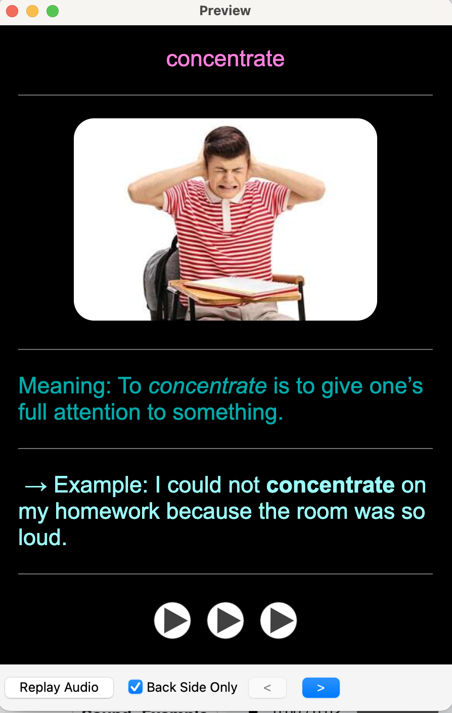
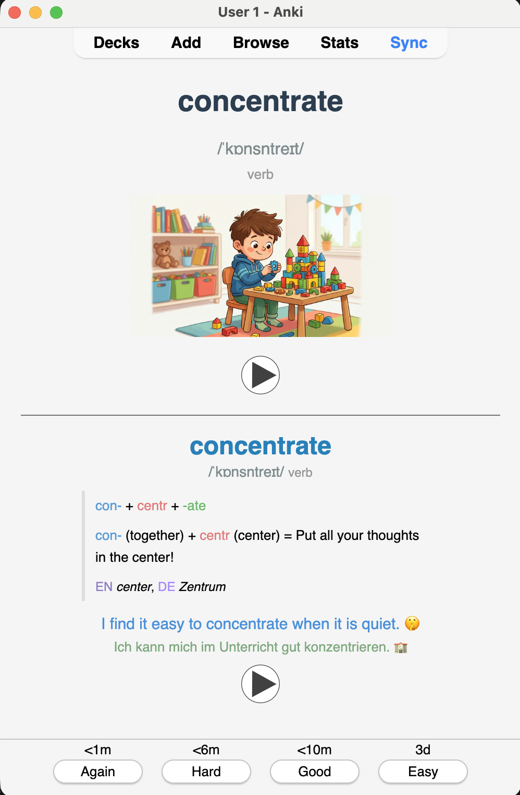
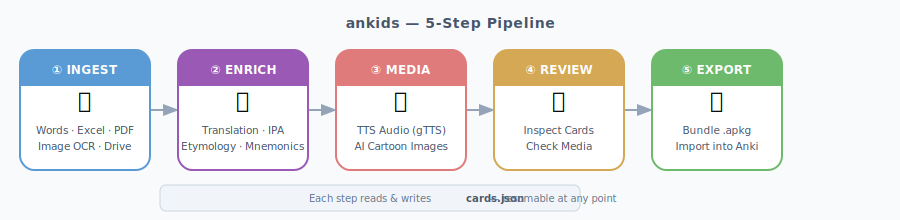
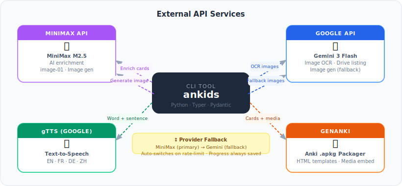
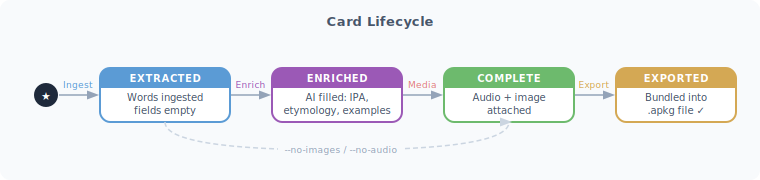
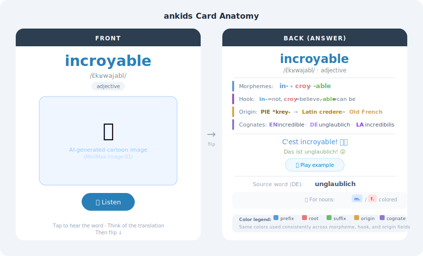
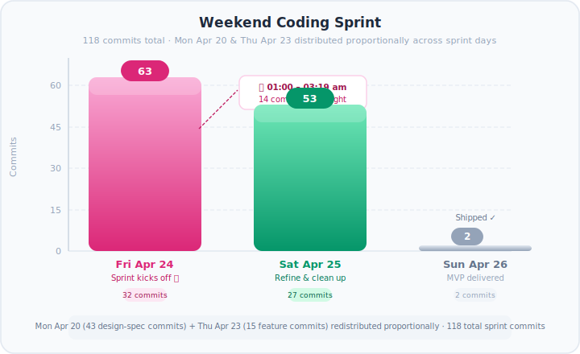
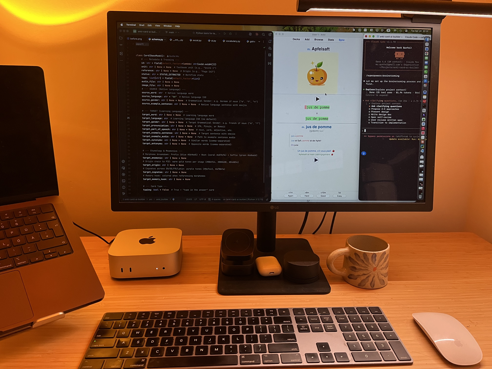
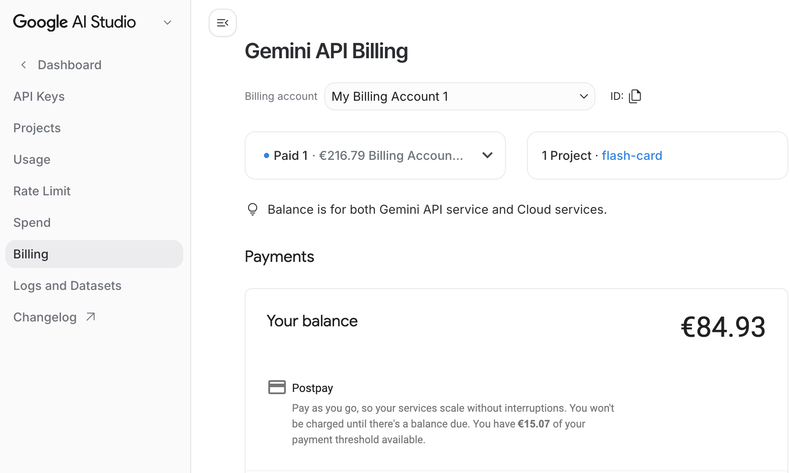
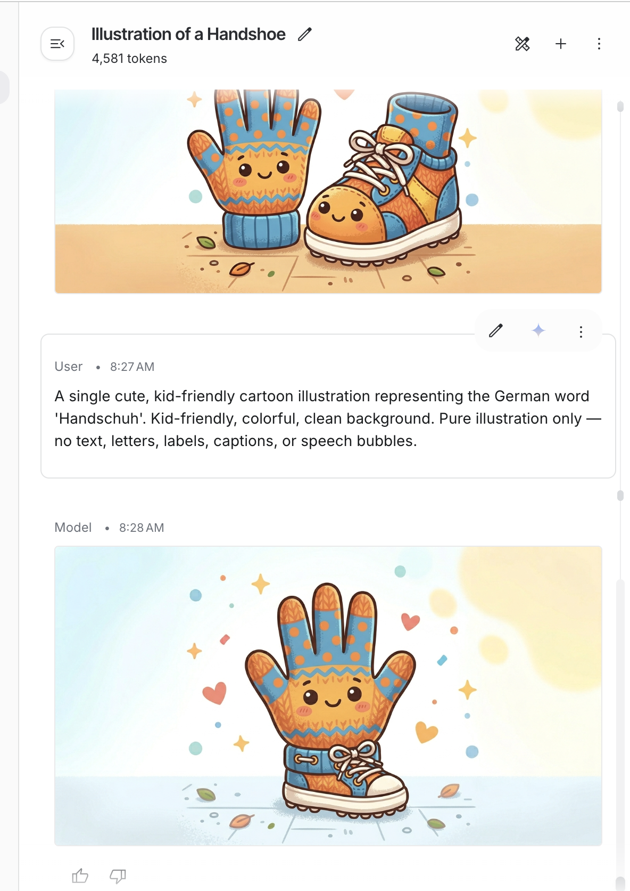

# ankids: I Built My Daughter Personalized Anki Cards in a Weekend

> *Every parent wants to help. Most of us don't know how. This is one attempt.*

---

## A Note Before We Begin

Every line of code in this project is an act of care.

We live in an age that is extraordinarily good at capturing attention — headlines, notifications, feeds that refresh forever. It is easy to spend a weekend consuming the world's problems without solving any of them. At some point I asked myself a simple question: *what if I put that time somewhere that actually matters?*

My daughter was struggling with French vocabulary. Not dramatically — she is fine, school is fine — but I could see the friction. New words that didn't stick. Flashcards that didn't match her textbook. That small, persistent friction that accumulates over months into a quiet reluctance to try.

So I opened my laptop on a Friday evening and started building.

By Sunday night she had a deck of 80 personalized French cards — cartoon illustrations, pronunciation audio, color-coded etymology, mnemonics written for a nine-year-old. She opened Anki on her iPad, flipped through a few cards, and looked up with a grin.

*"Papa, this one has a funny picture."*

Every overnight commit, every refactored function, every dollar spent on API calls — worth it.

---

## The Market Gap Nobody Has Fixed

Anki is used by millions of learners worldwide. The spaced repetition algorithm is one of the most rigorously validated tools in cognitive science. The ecosystem is mature: desktop, mobile, offline, synced.

But the content inside that ecosystem is broken.

The [Anki shared deck library](https://ankiweb.net/shared/info/1104981491) has tens of thousands of decks — and almost none of them match a specific child's specific textbook, this week's chapter, at their level. The cards are designed for adults: dense, text-only, no images, no audio, no memory hooks. A child learning *Unité 3* of their school French program needs vocabulary from *that* unit, in a format that holds a nine-year-old's attention.

Making good flashcards by hand is genuinely tedious. For each word: translation, IPA pronunciation, example sentence, counter-example, image, audio. Add etymology and a mnemonic and you're looking at 20–30 minutes per word. For a 40-word unit, that's a part-time job.

Every parent who has tried to build "a better Anki" ends up rebuilding Anki — and abandoning it. There are graveyard repositories full of custom flashcard apps that died when the developer got busy. The gap is not in the study app. The gap is in *personalized content generation*.

That is the only problem `ankids` solves.

---

## The Approach: Feed the Wheel, Don't Replace It

`ankids` doesn't compete with Anki. It feeds it.

The tool takes any input — a word list, an Excel file, a PDF textbook, a folder of iPhone photos — and runs it through a five-step AI pipeline that ends with a ready-to-import `.apkg` file. Anki handles everything after that: sync, scheduling, mobile, progress tracking.

Three AI capabilities made this possible:

**Vision models** can OCR a photo of a textbook page and extract structured vocabulary — words, translations, example sentences — in one pass. A parent photographs a homework sheet; the tool reads it.

**Language models** can enrich raw vocabulary with etymology, morpheme breakdowns, IPA pronunciation, cognates, and kid-friendly mnemonics at scale. What would take a linguist an hour per word takes seconds per batch.

**Image and audio models** can generate a cartoon illustration and a pronunciation clip for every word. A child hears the word and sees a memorable image before they've read the definition.

Wire these together with a resumable state machine and you have a weekend project that actually works.

---

## Before and After

Here is what the shared deck community provides:



A text-only card with a translation. Functional, forgettable.

Here is what `ankids` generates from the same vocabulary:



The same word, now with an AI-generated cartoon illustration, IPA pronunciation, grammatical gender colored by convention, color-coded morpheme breakdown, an origin chain back to Proto-Indo-European, cognates across four languages, a memory hook, and a bilingual example sentence with TTS audio. A card that shows *why* a word looks the way it does is orders of magnitude easier to retain than one that restates the definition.

---

## How It Works

### The 5-Step Pipeline



Each step reads and writes a shared `cards.json` file. Every step is independently restartable — if image generation hits a rate limit at card 847 of 1,000, re-run `ankids media` and it resumes from where it stopped.

### Input Sources

The ingestion layer accepts six source types: `--words` (CSV), Excel/CSV files, PDFs, single images, folders of images, and Google Drive URLs. A single `_detect_input_type()` function dispatches to the right handler.

HEIC support (iPhone's native photo format) was deliberate. My daughter's textbook lives on an iPhone camera roll. The pipeline handles HEIC → Gemini Vision OCR → structured JSON in one step via `pillow-heif`.

### External Services



MiniMax serves as both the enrichment LLM and the primary image generator. Google Gemini handles OCR and acts as the image generation fallback. If either provider rate-limits, the pipeline falls back automatically and saves progress.

### Card Lifecycle



### Workspace Layout

```
workspace/
└── a1b2c3d4/
    ├── cards.json               ← single source of truth
    ├── media/
    │   ├── {uuid}_audio.mp3     ← word TTS
    │   ├── {uuid}_example_audio.mp3
    │   └── {uuid}_image.png     ← AI cartoon
    └── MyDeck.apkg              ← ready to import
```

UUID-scoped isolation means multiple decks can run in parallel without collisions, and the workspace persists between sessions — critical when a 1,000-image batch takes hours.

---

## What Makes a Card Memorable

### The Etymology Engine

For Western European languages, a large fraction of vocabulary shares Latin or Greek roots. A child who understands that *in-* means "not" and *-croy-* comes from *credere* ("to believe") can decode *incroyable* even if they've never seen it before. That's not memorization — it's linguistic intuition.

The enrichment prompt produces four fields per card, each with consistent color coding:

| Field | Color scheme | Purpose |
|---|---|---|
| `target_mnemonic` | Blue prefix · Coral root · Green suffix | Morpheme breakdown |
| `target_origin` | Gold tones | PIE → Latin → Old French chain |
| `target_cognates` | Purple tones | EN / DE / FR / Latin cognate family |
| `target_memory_hook` | Morpheme colors | One-line hook using the breakdown |

For *incroyable*:

```
Mnemonic:    <span color="#5b9bd5">in-</span> + <span color="#e07b7b">croy</span> + <span color="#6dba6d">-able</span>

Origin:      <span color="#8B6914">PIE *krey-</span> →
             <span color="#B8860B">Latin credere</span> →
             <span color="#D4A854">Old French incroyable</span>

Cognates:    <span color="#8e7cc3">EN</span> incredible,
             <span color="#a78bfa">DE</span> unglaublich,
             <span color="#7c3aed">LA</span> incredibilis

Memory hook: <span color="#5b9bd5">in-</span> = not +
             <span color="#e07b7b">croy</span> = believe +
             <span color="#6dba6d">-able</span> = can be → "not believable!"
```

This HTML renders directly inside Anki's card template. Etymology sections are conditionally shown — atomic words that don't benefit from breakdown simply skip the block.

Gender coloring follows the same palette: masculine nouns get a soft blue, feminine a coral red, neuter a neutral grey. The same color means the same thing, everywhere on the card.

### The Card Template



The front: target word, IPA, part-of-speech, AI cartoon image, audio button. The back: full etymology stack, example sentences with audio, source word, gender badge.

A "Type-in" variant shows the source word on the front and prompts the learner to type the answer before revealing it. The `typing: bool` flag on the data model drives the template selection at export time.

### The Data Model

The `Card` Pydantic model is the contract across every pipeline stage:

```python
class Card(BaseModel):
    id: str = Field(default_factory=lambda: str(uuid.uuid4()))
    unit: str | None = None          # e.g. "Unité 3"
    status: str = STATUS_EXTRACTED   # extracted → enriched → complete

    source_word: str
    source_language: str = "de"
    source_gender: str | None = None

    target_word: str | None = None
    target_language: str
    target_pronunciation: str | None = None   # IPA or Pinyin
    target_part_of_speech: str | None = None
    target_example_sentence: str | None = None
    target_mnemonic: str | None = None
    target_origin: str | None = None
    target_cognates: str | None = None
    target_memory_hook: str | None = None

    typing: bool = False
```

Card merging is keyed on `(source_word, target_language)`. Re-ingesting the same word list never overwrites existing enrichment or media — new words are added, existing cards are preserved.

---

## Building It: 126 Commits Over a Weekend

Here is the actual commit activity for the sprint, with Monday's design-spec work and Thursday's first-feature commits distributed proportionally across the three coding days:



The Monday work was architecture: schema drafts, prompt specs, system design — all written before a single line of runtime code. By Thursday evening the first feature (image OCR via Gemini) was live at **21:30**. By 03:19 on Friday morning a refactoring pass had introduced shared constants, proper API key validation, and `ClickException` handling. Those 14 commits between midnight and 3am represent flow state: the implementation validating itself in real time.

Saturday was refinement: docs, workspace isolation, the Gemini enrichment provider, incremental saves. By Sunday morning the MVP was in the hands of my first user.

Total: **126 commits**, heaviest sustained work from **Thursday night through Saturday evening**. The longest session ran from **00:30 to 03:19** while the rest of the house slept.

Working with 10 concurrent AI agents shifts the bottleneck. Agents can produce working code in seconds. The constraint becomes *decisions* — which design to accept, which edge case to prioritize, which abstraction to commit to. That is a different kind of exhaustion than solo coding. It does not live in your hands. It lives behind your eyes.

---

## What I Learned the Hard Way

### 1. Your Laptop Is Not a GPU Server

The project started with the ambition of running image generation locally. My Mac Mini (M4, 16 GB unified memory) is a capable machine — it ran 10 parallel AI coding agents for days without complaint.



For image generation, it's a different story. Stable Diffusion XL, Flux, and Gemma 4 all require more than 16 GB of VRAM at usable quality. On shared unified memory, the models either refuse to load or produce one image every 3–4 minutes. For a 1,000-word deck, that's days. Use cloud APIs. This is a hardware constraint, not a software one.

### 2. The $84 Bill

The initial implementation used Google Gemini for image generation with aggressive async concurrency. Gemini's image model is excellent quality. It is not cheap at scale.



One weekend run cost **$84** in image generation calls alone. The async pipeline was working exactly as designed — which turned out to be both technically impressive and financially alarming.

The fix: switch the primary image provider to [MiniMax image-01](https://www.minimax.io), comparable quality at a fraction of the cost, with Gemini as automatic fallback.

```python
PROVIDERS = {
    "minimax": _generate_minimax,
    "gemini":  _generate_gemini,
}
```

A rate-limit (`429`) from either provider halts the batch gracefully and saves progress — nothing is lost. Set `MEDIA_CONCURRENCY=3` and monitor spend before running a large deck.

### 3. AI Takes Words Literally

The funniest failure: I asked the image model to illustrate the German word *Handschuhe* (gloves).



*Handschuhe* literally means "hand shoes." The model illustrated a hand and a shoe. Side by side. Smiling.

The fix was to pass the full language name to the prompt and explicitly tell the model to illustrate the *concept*, not decode the word:

```python
def _build_image_prompt(word: str, target_language: str) -> str:
    lang = _lang_full_name(target_language)  # "de" → "German"
    return (
        f"A single cute, kid-friendly cartoon illustration representing "
        f"the {lang} word '{word}'. "
        f"Pure illustration only — no text, letters, labels, or speech bubbles."
    )
```

Passing "German" rather than "de" dramatically reduced literal interpretations. The "no text" constraint was equally important — early versions overlaid the word on the image, which defeated the purpose.

### 4. Deleted Lines Cost Money Too

The raw git ledger for the sprint:

| Metric | Count |
|---|---|
| Total commits | 126 |
| Lines added | 15,558 |
| Lines deleted | 9,760 |
| Net codebase | 5,798 lines |
| Refactor / fix commits | 42 out of 126 (33%) |

Those 9,760 deleted lines are the cost of moving fast. Agents generate large blobs of code without checking whether an existing module already covers the ground. Two commits later you're unifying three slightly different prompt-building functions, or ripping out a YAML config system written at 2am to replace it with a `.env` loader that's half the size.

The three biggest cleanup commits:

- `"Clean the docs"` — **3,505 lines deleted**, 143 added. Intermediate planning files that accumulated during the sprint.
- `"Create MVP in first day"` — **3,224 lines deleted**, 24 added. A full prototype rewrite once the design stabilized.
- `"refactor: eliminate duplication across enrich, ingest, and CLI modules"` — 95 deleted, 230 added. Three modules had independently evolved the same JSON parsing helper.

The structural fix: run a code review pass *before* adding new features, not after. Asking an agent to audit for duplication before writing new code cuts churn dramatically. Ten minutes of "does this already exist?" pays for itself many times over in a sprint with 10 active agents.

### 5. The New Bottleneck Is You

When agents generate working code in seconds, the exhaustion moves. It is not in your hands anymore. Every 10 minutes brings a design question that would previously have taken a day of background thinking: batch enrichment or per-card? Absolute or relative media paths? Merge by word string or UUID? These decisions compound. Make a bad one at midnight and you're refactoring state management at 2am while your daughter sleeps.

The pace is exhilarating. It is also real work. I finished the MVP on Sunday morning and slept for most of the afternoon.

<div align="center">
<svg width="100%" viewBox="0 0 680 500" role="img" xmlns="http://www.w3.org/2000/svg" font-family="system-ui,-apple-system,BlinkMacSystemFont,'Segoe UI',sans-serif">
<title>The cognitive cost of AI-accelerated development</title>
<desc>A cartoon engineer surrounded by five AI robots, each asking a design question. The engineer looks exhausted with hands on head.</desc>
<style>
.rb1{fill:#c084fc;stroke:#7c3aed;stroke-width:1.5}
.rb2{fill:#fb923c;stroke:#c2410c;stroke-width:1.5}
.rb3{fill:#4ade80;stroke:#15803d;stroke-width:1.5}
.rb4{fill:#60a5fa;stroke:#1d4ed8;stroke-width:1.5}
.rb5{fill:#f472b6;stroke:#be185d;stroke-width:1.5}
</style>
<rect width="680" height="500" rx="14" fill="#eef2ff"/>
<rect x="1" y="1" width="678" height="498" rx="14" fill="none" stroke="#c7d2fe" stroke-width="1"/>
<text x="340" y="27" text-anchor="middle" font-size="14" font-weight="600" fill="#1e293b">The new bottleneck</text>
<text x="340" y="43" text-anchor="middle" font-size="11" fill="#64748b">When agents code in seconds, every decision is yours</text>
<line x1="340" y1="148" x2="340" y2="220" stroke="#a5b4fc" stroke-width="1.2" stroke-dasharray="4,3"/>
<line x1="504" y1="158" x2="368" y2="243" stroke="#a5b4fc" stroke-width="1.2" stroke-dasharray="4,3"/>
<line x1="476" y1="372" x2="362" y2="278" stroke="#a5b4fc" stroke-width="1.2" stroke-dasharray="4,3"/>
<line x1="204" y1="372" x2="318" y2="278" stroke="#a5b4fc" stroke-width="1.2" stroke-dasharray="4,3"/>
<line x1="176" y1="158" x2="312" y2="243" stroke="#a5b4fc" stroke-width="1.2" stroke-dasharray="4,3"/>
<rect x="255" y="48" width="170" height="26" rx="8" fill="white" stroke="#c084fc" stroke-width="1.5"/>
<polygon points="328,74 340,84 352,74" fill="white" stroke="#c084fc" stroke-width="1.5" stroke-linejoin="round"/>
<text x="340" y="65" text-anchor="middle" font-size="10" font-weight="600" fill="#6d28d9">Batch or per-card?</text>
<rect x="538" y="177" width="126" height="26" rx="8" fill="white" stroke="#fb923c" stroke-width="1.5"/>
<polygon points="538,184 527,190 538,196" fill="white" stroke="#fb923c" stroke-width="1.5" stroke-linejoin="round"/>
<text x="601" y="194" text-anchor="middle" font-size="10" font-weight="600" fill="#9a3412">String or UUID?</text>
<rect x="506" y="377" width="152" height="26" rx="8" fill="white" stroke="#4ade80" stroke-width="1.5"/>
<polygon points="506,384 495,390 506,396" fill="white" stroke="#4ade80" stroke-width="1.5" stroke-linejoin="round"/>
<text x="582" y="394" text-anchor="middle" font-size="10" font-weight="600" fill="#14532d">Save state now?</text>
<rect x="18" y="377" width="152" height="26" rx="8" fill="white" stroke="#60a5fa" stroke-width="1.5"/>
<polygon points="170,384 181,390 170,396" fill="white" stroke="#60a5fa" stroke-width="1.5" stroke-linejoin="round"/>
<text x="94" y="394" text-anchor="middle" font-size="10" font-weight="600" fill="#1e3a8a">Absolute paths?</text>
<rect x="18" y="177" width="126" height="26" rx="8" fill="white" stroke="#f472b6" stroke-width="1.5"/>
<polygon points="144,184 155,190 144,196" fill="white" stroke="#f472b6" stroke-width="1.5" stroke-linejoin="round"/>
<text x="81" y="194" text-anchor="middle" font-size="10" font-weight="600" fill="#9d174d">Which API first?</text>
<rect x="330" y="137" width="8" height="8" rx="3" class="rb1"/>
<rect x="342" y="137" width="8" height="8" rx="3" class="rb1"/>
<rect x="326" y="109" width="28" height="28" rx="5" class="rb1"/>
<rect x="319" y="112" width="8" height="18" rx="4" class="rb1"/>
<rect x="353" y="112" width="8" height="18" rx="4" class="rb1"/>
<rect x="333" y="117" width="14" height="10" rx="2" fill="white" opacity="0.4"/>
<rect x="328" y="91" width="24" height="18" rx="5" class="rb1"/>
<circle cx="336" cy="99" r="3" fill="white"/>
<circle cx="344" cy="99" r="3" fill="white"/>
<circle cx="336" cy="100" r="1.5" fill="#7c3aed"/>
<circle cx="344" cy="100" r="1.5" fill="#7c3aed"/>
<line x1="340" y1="91" x2="340" y2="81" stroke="#7c3aed" stroke-width="1.5" stroke-linecap="round"/>
<circle cx="340" cy="77" r="4" class="rb1"/>
<rect x="500" y="202" width="8" height="8" rx="3" class="rb2"/>
<rect x="512" y="202" width="8" height="8" rx="3" class="rb2"/>
<rect x="496" y="174" width="28" height="28" rx="5" class="rb2"/>
<rect x="489" y="177" width="8" height="18" rx="4" class="rb2"/>
<rect x="523" y="177" width="8" height="18" rx="4" class="rb2"/>
<rect x="503" y="182" width="14" height="10" rx="2" fill="white" opacity="0.4"/>
<rect x="498" y="156" width="24" height="18" rx="5" class="rb2"/>
<circle cx="506" cy="164" r="3" fill="white"/>
<circle cx="518" cy="164" r="3" fill="white"/>
<circle cx="506" cy="165" r="1.5" fill="#c2410c"/>
<circle cx="518" cy="165" r="1.5" fill="#c2410c"/>
<line x1="510" y1="156" x2="510" y2="146" stroke="#c2410c" stroke-width="1.5" stroke-linecap="round"/>
<circle cx="510" cy="142" r="4" class="rb2"/>
<rect x="470" y="402" width="8" height="8" rx="3" class="rb3"/>
<rect x="482" y="402" width="8" height="8" rx="3" class="rb3"/>
<rect x="466" y="374" width="28" height="28" rx="5" class="rb3"/>
<rect x="459" y="377" width="8" height="18" rx="4" class="rb3"/>
<rect x="493" y="377" width="8" height="18" rx="4" class="rb3"/>
<rect x="473" y="382" width="14" height="10" rx="2" fill="white" opacity="0.4"/>
<rect x="468" y="356" width="24" height="18" rx="5" class="rb3"/>
<circle cx="476" cy="364" r="3" fill="white"/>
<circle cx="488" cy="364" r="3" fill="white"/>
<circle cx="476" cy="365" r="1.5" fill="#15803d"/>
<circle cx="488" cy="365" r="1.5" fill="#15803d"/>
<line x1="480" y1="356" x2="480" y2="346" stroke="#15803d" stroke-width="1.5" stroke-linecap="round"/>
<circle cx="480" cy="342" r="4" class="rb3"/>
<rect x="190" y="402" width="8" height="8" rx="3" class="rb4"/>
<rect x="202" y="402" width="8" height="8" rx="3" class="rb4"/>
<rect x="186" y="374" width="28" height="28" rx="5" class="rb4"/>
<rect x="179" y="377" width="8" height="18" rx="4" class="rb4"/>
<rect x="213" y="377" width="8" height="18" rx="4" class="rb4"/>
<rect x="193" y="382" width="14" height="10" rx="2" fill="white" opacity="0.4"/>
<rect x="188" y="356" width="24" height="18" rx="5" class="rb4"/>
<circle cx="196" cy="364" r="3" fill="white"/>
<circle cx="208" cy="364" r="3" fill="white"/>
<circle cx="196" cy="365" r="1.5" fill="#1d4ed8"/>
<circle cx="208" cy="365" r="1.5" fill="#1d4ed8"/>
<line x1="200" y1="356" x2="200" y2="346" stroke="#1d4ed8" stroke-width="1.5" stroke-linecap="round"/>
<circle cx="200" cy="342" r="4" class="rb4"/>
<rect x="160" y="202" width="8" height="8" rx="3" class="rb5"/>
<rect x="172" y="202" width="8" height="8" rx="3" class="rb5"/>
<rect x="156" y="174" width="28" height="28" rx="5" class="rb5"/>
<rect x="149" y="177" width="8" height="18" rx="4" class="rb5"/>
<rect x="183" y="177" width="8" height="18" rx="4" class="rb5"/>
<rect x="163" y="182" width="14" height="10" rx="2" fill="white" opacity="0.4"/>
<rect x="158" y="156" width="24" height="18" rx="5" class="rb5"/>
<circle cx="166" cy="164" r="3" fill="white"/>
<circle cx="178" cy="164" r="3" fill="white"/>
<circle cx="166" cy="165" r="1.5" fill="#be185d"/>
<circle cx="178" cy="165" r="1.5" fill="#be185d"/>
<line x1="170" y1="156" x2="170" y2="146" stroke="#be185d" stroke-width="1.5" stroke-linecap="round"/>
<circle cx="170" cy="142" r="4" class="rb5"/>
<rect x="296" y="316" width="88" height="50" rx="5" fill="#1e293b"/>
<rect x="302" y="322" width="76" height="38" rx="3" fill="#334155"/>
<line x1="308" y1="331" x2="358" y2="331" stroke="#94a3b8" stroke-width="1.5"/>
<line x1="308" y1="338" x2="370" y2="338" stroke="#7c3aed" stroke-width="1.5"/>
<line x1="308" y1="345" x2="350" y2="345" stroke="#94a3b8" stroke-width="1.5"/>
<line x1="308" y1="352" x2="364" y2="352" stroke="#fb923c" stroke-width="1.5"/>
<rect x="284" y="366" width="112" height="6" rx="3" fill="#1e293b"/>
<rect x="312" y="274" width="56" height="58" rx="10" fill="#334155"/>
<circle cx="340" cy="238" r="36" fill="#fde8c4" stroke="#d4a862" stroke-width="1.5"/>
<path d="M304 230 Q308 200 340 196 Q372 200 376 230" fill="#3d2b1f"/>
<ellipse cx="328" cy="236" rx="8" ry="7" fill="white"/>
<path d="M320 230 Q328 235 336 230" fill="#3d2b1f"/>
<circle cx="328" cy="237" r="3.5" fill="#3d2b1f"/>
<circle cx="326" cy="235" r="1.2" fill="white"/>
<ellipse cx="328" cy="244" rx="9" ry="3" fill="#c9a08a" opacity="0.45"/>
<ellipse cx="352" cy="236" rx="8" ry="7" fill="white"/>
<path d="M344 230 Q352 235 360 230" fill="#3d2b1f"/>
<circle cx="352" cy="237" r="3.5" fill="#3d2b1f"/>
<circle cx="350" cy="235" r="1.2" fill="white"/>
<ellipse cx="352" cy="244" rx="9" ry="3" fill="#c9a08a" opacity="0.45"/>
<path d="M338 250 Q340 254 342 250" fill="none" stroke="#c8956c" stroke-width="1.5" stroke-linecap="round"/>
<path d="M331 259 Q335 263 340 259 Q345 255 349 259" fill="none" stroke="#9c6650" stroke-width="2" stroke-linecap="round"/>
<path d="M314 278 Q296 262 304 246 Q310 236 316 222" stroke="#334155" stroke-width="12" stroke-linecap="round" fill="none"/>
<path d="M366 278 Q384 262 376 246 Q370 236 364 222" stroke="#334155" stroke-width="12" stroke-linecap="round" fill="none"/>
<circle cx="316" cy="222" r="9" fill="#fde8c4" stroke="#d4a862" stroke-width="1.5"/>
<circle cx="364" cy="222" r="9" fill="#fde8c4" stroke="#d4a862" stroke-width="1.5"/>
<ellipse cx="374" cy="228" rx="3.5" ry="5" fill="#93c5fd"/>
<polygon points="374,223 377,228 371,228" fill="#93c5fd"/>
<ellipse cx="380" cy="238" rx="3" ry="4.5" fill="#93c5fd"/>
<polygon points="380,234 383,238 377,238" fill="#93c5fd"/>
<text x="340" y="202" text-anchor="middle" font-size="19" font-weight="700" fill="#f97316">???</text>
<circle cx="376" cy="214" r="4" fill="#fef9c3" stroke="#f59e0b" stroke-width="1"/>
<circle cx="387" cy="206" r="6" fill="#fef9c3" stroke="#f59e0b" stroke-width="1"/>
<circle cx="400" cy="199" r="8" fill="#fef9c3" stroke="#f59e0b" stroke-width="1"/>
<rect x="400" y="186" width="58" height="20" rx="10" fill="#fef9c3" stroke="#f59e0b" stroke-width="1"/>
<text x="429" y="200" text-anchor="middle" font-size="10" font-weight="700" fill="#92400e">DECIDE</text>
<rect x="396" y="332" width="16" height="18" rx="2" fill="#f8fafc" stroke="#94a3b8" stroke-width="1"/>
<path d="M412 337 Q418 337 418 341 Q418 345 412 345" fill="none" stroke="#94a3b8" stroke-width="1"/>
<path d="M400 329 Q402 323 400 317" fill="none" stroke="#cbd5e1" stroke-width="1.5" stroke-linecap="round"/>
<path d="M406 329 Q408 321 406 315" fill="none" stroke="#cbd5e1" stroke-width="1.5" stroke-linecap="round"/>
<rect x="80" y="460" width="520" height="24" rx="8" fill="#e0e7ff"/>
<text x="340" y="476" text-anchor="middle" font-size="10" fill="#4338ca">10 agents · 1 engineer · every architectural call, every 10 minutes</text>
</svg>
</div>

---

## Try It

```bash
# Install (Python 3.12+)
uv sync
cp .env.example .env
```

Minimal `.env`:

```
MINIMAX_API_KEY=your_minimax_key
GOOGLE_API_KEY=your_google_key
LEARNER_PROFILE="ages 9-12, kid-friendly with emojis"
```

### One command

```bash
# From a word list
ankids run --words "chat,maison,incroyable,bonjour" --lang-target fr --lang-source de

# From iPhone photos of textbook pages (HEIC supported)
ankids run --input ./input/french/ --lang-target fr --lang-source de --deck "Unité 3"

# From a PDF textbook
ankids run --input textbook.pdf --lang-target fr --lang-source de

# Incremental — add words to an existing workspace
ankids run --words "école,professeur" --lang-target fr --output workspace/a1b2c3d4
```

### Step by step

```bash
ankids ingest --input ./input/french/ --lang-target fr --lang-source de
ankids enrich --output workspace/a1b2c3d4
ankids media  --output workspace/a1b2c3d4
ankids review --output workspace/a1b2c3d4
ankids export --output workspace/a1b2c3d4 --deck "French Unit 3"
```

### Cost controls

```bash
ankids run --words "chat,chien" --lang-target fr --no-images   # text only
ankids run --words "chat,chien" --lang-target fr --no-audio    # skip TTS
ankids run --words "chat,chien" --lang-target fr --typing      # type-in cards
IMAGE_PROVIDER=minimax MEDIA_CONCURRENCY=2 ankids media --output workspace/a1b2c3d4
```

### CLI reference

| Command | What it does |
|---|---|
| `run` | Full pipeline: ingest + enrich + media + export |
| `ingest` | Extract words from file, folder, or `--words` |
| `enrich` | Fill all card fields with AI |
| `media` | Generate TTS audio and AI images |
| `review` | Display cards and media status |
| `export` | Bundle into `.apkg` for Anki |
| `clean` | Delete workspace and start fresh |

---

## What Comes Next

The MVP works. One real user loves it. A few directions from here:

**More languages.** The pipeline is language-agnostic — set `--lang-target` to anything gTTS supports. Spanish, Italian, and Mandarin need tested prompt adjustments for Pinyin and IPA.

**Smarter image prompts.** The *Handschuhe* failure points to a broader issue: compound words and idioms need a concept summary rather than the raw word. Using `target_memory_hook` as the image prompt input is the next experiment.

**Deck diffing.** Re-importing an updated `.apkg` requires manual duplicate handling. A proper diff-and-patch workflow, tracking cards by stable UUID across exports, would make iterative updates seamless.

**A curriculum planner.** The long-term vision: generate an entire semester's worth of decks from a syllabus PDF, pre-scheduled so cards arrive in Anki the week before they appear in class.

---

## Stack

| Layer | Technology |
|---|---|
| CLI | Typer + Python 3.12 |
| Schema / validation | Pydantic v2 |
| Image OCR | Google Gemini 3 Flash (vision) |
| AI enrichment | MiniMax M2.5 (via Anthropic SDK) |
| Image generation | MiniMax image-01 (primary) / Gemini 3.1 Flash (fallback) |
| Audio | gTTS |
| Anki packaging | genanki |
| PDF extraction | PyMuPDF |
| HEIC support | pillow-heif |
| Async HTTP | httpx + asyncio |
| Linting / types | ruff + mypy |
| Package management | uv + hatchling |

---

*Open source. Pull requests welcome — especially from parents who know the feeling.*
