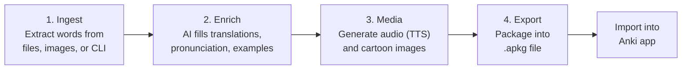

# Anki Card AI Builder

AI-powered Anki flashcard generator for language learning. Extracts vocabulary from various sources, enriches cards with AI (translations, pronunciations, example sentences, mnemonics, synonyms/antonyms), generates audio and images, and exports to `.apkg` for Anki.

> **Note**: This tool generates `.apkg` files only. You need the [Anki desktop app](https://apps.ankiweb.net/) or [AnkiMobile](https://apps.apple.com/app/ankimobile-flashcards/id373493387) / [AnkiDroid](https://play.google.com/store/apps/details?id=com.ichi2.anki) to import and study the cards.

## How It Works



| Step | What happens | Output |
|------|-------------|--------|
| **Ingest** | Extracts vocabulary from your input (words, Excel, PDF, image OCR, Google Drive) | `cards.json` with raw word list |
| **Enrich** | AI adds translations, IPA pronunciation, example sentences, mnemonics, etymology | `cards.json` with full card data |
| **Media** | Generates TTS audio for words and example sentences, plus cartoon images | `media/*.mp3` and `media/*.png` |
| **Export** | Bundles cards + media into an Anki-compatible package | `.apkg` file ready to import |

The `run` command executes steps 1-3 automatically. Then use `export` to create the `.apkg` file and import it into Anki.

## Features

- **Multiple input sources**: Excel/CSV, PDF, images (OCR via Google Gemini), Google Drive folders, or direct word input
- **AI enrichment**: Translations, IPA/Pinyin/Romaji pronunciation, grammatical gender, part of speech, example sentences, mnemonic word breakdowns, synonyms, and antonyms — powered by [MiniMax M2.5](https://www.minimax.io/)
- **Media generation**: Text-to-speech audio (gTTS) and AI-generated cartoon images (MiniMax image-01 or Google Gemini)
- **Two card types**: Basic (show word, reveal answer) and Type-in (type the answer to practice spelling) — use `--typing` to enable
- **Anki export**: `.apkg` files with HTML card templates and embedded media
- **Workspace isolation**: Each run gets its own `workspace/<uuid>` folder — run multiple projects in parallel
- **Incremental workflow**: Cards are merged across runs, so you can add words over time
- **HEIC/HEIF support**: Accepts iPhone photos directly for OCR ingestion

### Card Types

| Type | Flag | Front | Back |
|------|------|-------|------|
| **Basic** | (default) | Target word + pronunciation + image + audio | Source word + mnemonic + etymology + example sentences |
| **Type-in** | `--typing` | Source word + image + audio + text input | Checks typed answer + shows full card details |

## Setup

Requires Python 3.12+.

```bash
# Install with uv
uv sync

# Copy and fill in your API keys
cp .env.example .env
```

### API Keys

| Key | Required for |
|-----|-------------|
| `MINIMAX_API_KEY` | AI enrichment (MiniMax M2.5) + image generation (MiniMax image-01) |
| `GOOGLE_API_KEY` | Image OCR (Google Gemini) + Google Drive folder ingestion + Gemini image generation |

## Supported Languages

| Language | Code | TTS | Tested |
|----------|------|-----|--------|
| English | `en` | gTTS | Yes |
| French | `fr` | gTTS | Yes |
| German | `de` | gTTS | Yes |
| Chinese | `zh` | gTTS (zh-CN) | No |
| Japanese | `ja` | — | No |
| Korean | `ko` | — | No |
| Spanish | `es` | — | No |
| Italian | `it` | — | No |
| Portuguese | `pt` | — | No |
| Russian | `ru` | — | No |
| Arabic | `ar` | — | No |

AI enrichment (MiniMax M2.5) supports all languages above. TTS audio (gTTS) currently maps `en`, `fr`, `de`, and `zh` — other languages fall back to the language code directly.

## Supported Input Types

| Input | Extensions / Format | API Used | Notes |
|-------|-------------------|----------|-------|
| **Words** | `--words "cat,dog,run"` | None | Comma-separated, parsed locally |
| **Excel/CSV** | `.xlsx`, `.csv` | None | Fuzzy header mapping (supports DE/EN column names) |
| **PDF** | `.pdf` | MiniMax M2.5 | Text-based PDFs only (not scanned images) |
| **Image** | `.png`, `.jpg`, `.jpeg`, `.bmp`, `.tiff`, `.webp`, `.heic`, `.heif` | Google Gemini | OCR extraction, returns pre-enriched cards |
| **Folder** | Directory path | Gemini + MiniMax | Processes all supported images and PDFs in folder |
| **Google Drive** | Drive folder URL | Google Drive API + Gemini + MiniMax | Downloads and processes all files in folder |

## Usage

### Language flags

- **`--lang-target`** (required): The language you are **learning**. This is what appears on the front of the card (e.g. `en` for English, `fr` for French).
- **`--lang-source`** (optional, default: `de`): Your **native language** — the language you already speak. This is shown on the back of the card for reference.

For example, if you speak German and are learning English: `--lang-target en --lang-source de`

### Full pipeline (recommended)

```bash
# From word list — creates a new workspace automatically
anki-builder run --words "Glove,Squirrel,impossible" --lang-target en

# From Excel/CSV
anki-builder run --input vocab.xlsx --lang-target en

# From PDF
anki-builder run --input textbook.pdf --lang-target en

# From image (OCR — supports PNG, JPG, HEIC, WebP, etc.)
anki-builder run --input photo.heic --lang-target en

# From a folder of images/PDFs
anki-builder run --input ./my-scans/ --lang-target en

# From Google Drive folder
anki-builder run --input "https://drive.google.com/drive/folders/..." --lang-target en
```

The `run` command prints the workspace path. Use `--output` to continue in an existing workspace:

```bash
# Continue in an existing workspace
anki-builder run --words "more,words" --lang-target en --output workspace/a1b2c3d4
```

### Step-by-step pipeline

Run each step individually, passing the workspace folder with `--output`:

```bash
# 1. Ingest words (creates workspace/a1b2c3d4/)
anki-builder ingest --words "Glove,Squirrel" --lang-target en
# or: anki-builder ingest --input vocab.xlsx --lang-target en

# 2. Enrich with AI
anki-builder enrich --output workspace/a1b2c3d4

# 3. Generate audio and images
anki-builder media --output workspace/a1b2c3d4

# 4. Review cards
anki-builder review --output workspace/a1b2c3d4

# 5. Export to .apkg
anki-builder export --output workspace/a1b2c3d4 --deck "English Vocabulary"
```

### Options

```bash
# Skip image or audio generation
anki-builder run --words "cat,dog" --lang-target en --no-images
anki-builder run --words "cat,dog" --lang-target en --no-audio

# Set source language (default: de/German)
anki-builder run --words "Hund,Katze" --lang-target en --lang-source de

# Create "type the answer" cards
anki-builder run --words "cat,dog" --lang-target en --typing

# Custom deck name
anki-builder run --input vocab.xlsx --lang-target en --deck "Unit 5 Words"

# Custom .apkg output path
anki-builder export --output workspace/a1b2c3d4 --deck "Test" --apkg ./my-deck.apkg

# Clean up a workspace
anki-builder clean --output workspace/a1b2c3d4
```

### CLI Reference

| Command | Description | `--output` |
|---------|-------------|------------|
| `run` | Full pipeline: ingest + enrich + media + review | Optional (auto-creates) |
| `ingest` | Extract vocabulary from input | Optional (auto-creates) |
| `enrich` | Fill missing fields with AI | Required |
| `media` | Generate TTS audio and AI images | Required |
| `review` | Show cards and media status | Required |
| `export` | Export to `.apkg` file | Required |
| `clean` | Delete a workspace folder | Required |

## Workspace Structure

Each run creates an isolated folder under `workspace/`:

```
workspace/
└── a1b2c3d4/           # 8-char UUID
    ├── cards.json       # All card data (state file)
    ├── media/           # Generated media
    │   ├── *_audio.mp3
    │   ├── *_example_audio.mp3
    │   └── *_image.png
    └── English.apkg     # Exported Anki deck
```

## Configuration

Environment variables (via `.env`):

| Variable | Default | Description |
|----------|---------|-------------|
| `MINIMAX_API_KEY` | — | Required for AI enrichment and MiniMax image generation |
| `GOOGLE_API_KEY` | — | Required for OCR, Google Drive, and Gemini image generation |
| `LEARNER_PROFILE` | `"ages 9-12, kid-friendly with emojis"` | Learner context for AI enrichment |
| `MEDIA_AUDIO_ENABLED` | `true` | Enable/disable audio generation |
| `MEDIA_IMAGE_ENABLED` | `true` | Enable/disable image generation |
| `MEDIA_CONCURRENCY` | `3` | Max concurrent image generation requests |
| `IMAGE_PROVIDER` | `minimax` | Image provider: `minimax` or `gemini` |
| `EXPORT_DECK_NAME` | `Vocabulary` | Default deck name for export |

## Development

```bash
# Install dev dependencies
uv sync --group dev

# Run tests
uv run pytest
```
