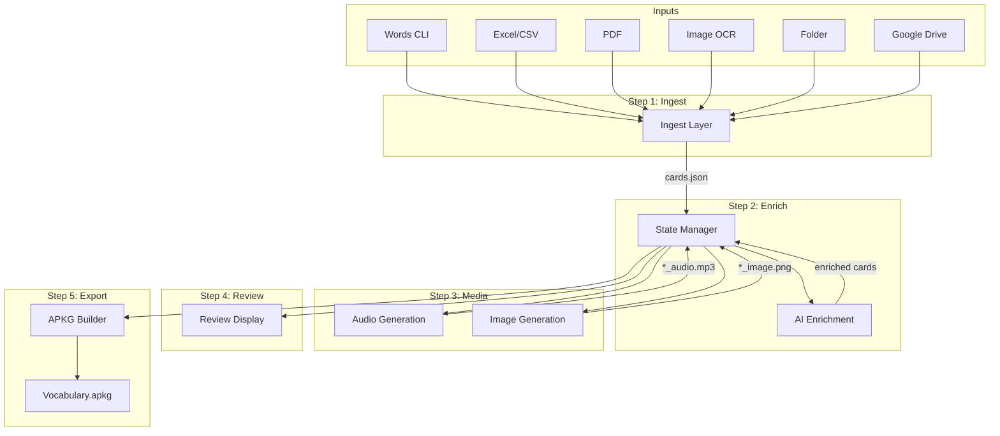
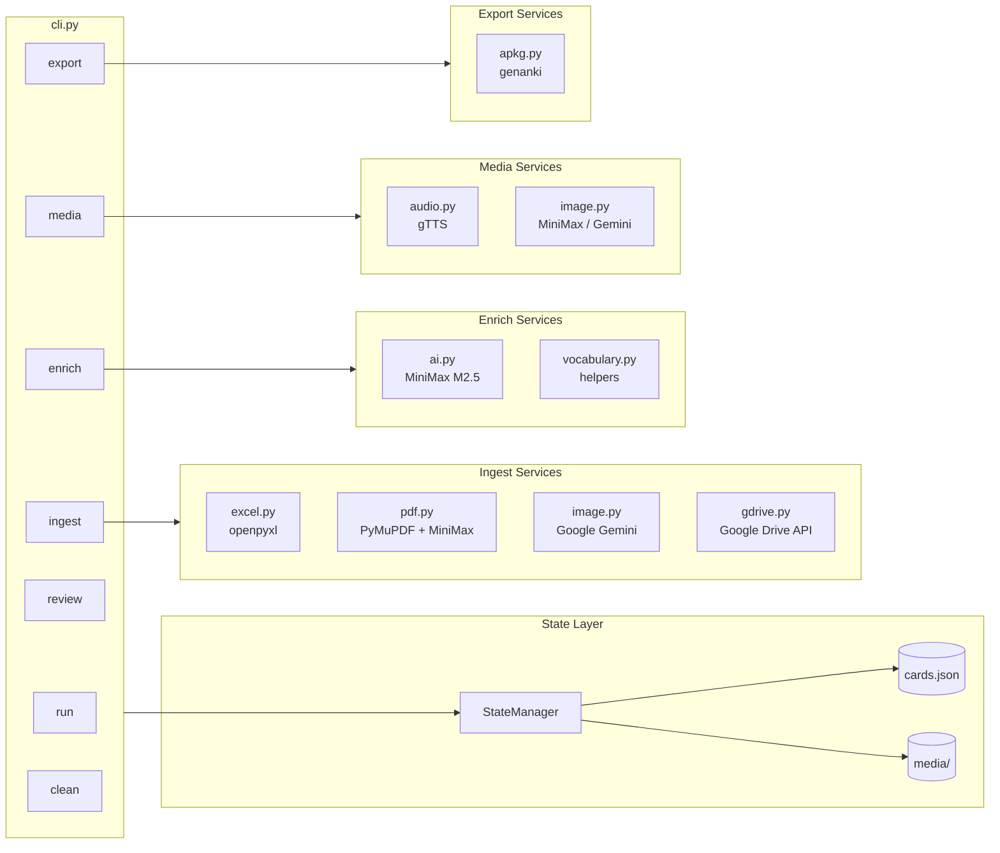
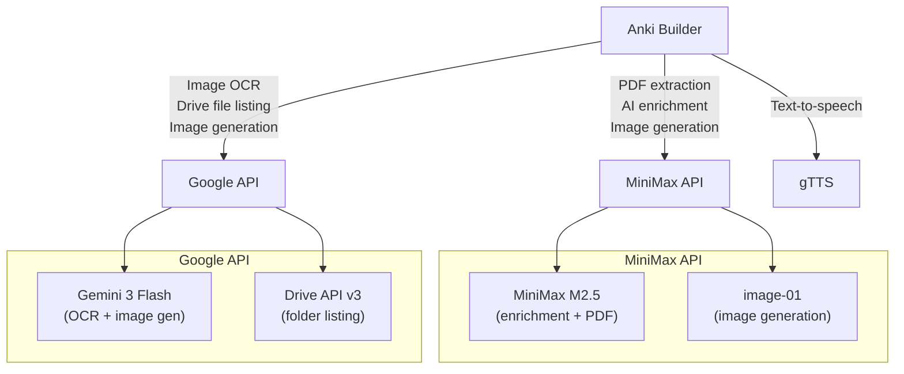
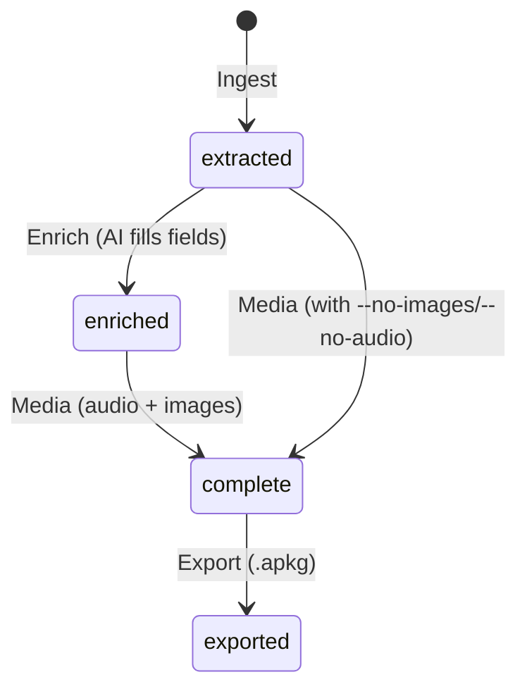

# Architecture

## System Overview

Anki Card AI Builder is a CLI pipeline that transforms vocabulary inputs into Anki flashcard decks. It follows a linear 5-step pipeline where each step reads/writes to a shared `cards.json` state file within an isolated workspace folder.

## Data Flow



## Component Architecture



## External Services



## Card Lifecycle



## Workspace Layout

Each pipeline run creates an isolated workspace:

```
workspace/
└── a1b2c3d4/                    # 8-char UUID folder
    ├── cards.json               # Shared state: list of Card objects
    ├── media/
    │   ├── {id}_audio.mp3       # Word TTS audio
    │   ├── {id}_example_audio.mp3  # Example sentence TTS
    │   └── {id}_image.png       # AI-generated illustration
    └── {DeckName}.apkg          # Final Anki export
```

## Key Design Decisions

- **State file as single source of truth**: All steps read/write `cards.json`. This enables incremental runs — re-running a step skips cards that already have the relevant data.
- **Intermediate saves**: Media generation saves `cards.json` after audio and after images separately, so progress is preserved if the process is interrupted.
- **Card merging by key**: Cards are keyed by `(source_word, target_language)`. Re-ingesting the same words preserves existing enrichment and media.
- **Provider fallback**: Image generation tries the primary provider first, then falls back to the secondary if it fails.
- **Workspace isolation**: Each run gets its own UUID folder under `workspace/`, avoiding collisions between parallel runs or different source materials.

## Project Structure

```
src/anki_builder/
├── cli.py              # Typer CLI — run, ingest, enrich, media, review, export, clean
├── config.py           # Environment config loading
├── schema.py           # Card data model (Pydantic)
├── state.py            # JSON state persistence + card merging
├── constants.py        # API endpoint constants
├── ingest/
│   ├── excel.py        # Excel/CSV ingestion (openpyxl)
│   ├── pdf.py          # PDF text extraction (PyMuPDF) + MiniMax vocabulary extraction
│   ├── image.py        # Image OCR (Google Gemini)
│   └── gdrive.py       # Google Drive folder ingestion
├── enrich/
│   ├── ai.py           # AI enrichment (MiniMax M2.5 via Anthropic SDK)
│   └── vocabulary.py   # Vocabulary prompt helpers
├── media/
│   ├── audio.py        # TTS audio generation (gTTS)
│   └── image.py        # AI image generation (MiniMax image-01 / Google Gemini)
└── export/
    └── apkg.py         # Anki .apkg export (genanki)
```
