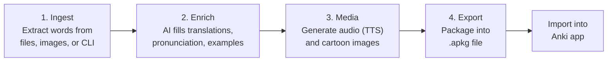

# README.md Rewrite Implementation Plan

> **For agentic workers:** REQUIRED SUB-SKILL: Use superpowers:subagent-driven-development (recommended) or superpowers:executing-plans to implement this plan task-by-task. Steps use checkbox (`- [ ]`) syntax for tracking.

**Goal:** Rewrite README.md as a structured reference document with 7 sections: Why, How It Works, Core Features, Screenshot, Get Started, Status/Roadmap, Contributing/License.

**Architecture:** Single-file rewrite of `README.md`. Content is derived from the design spec at `docs/superpowers/specs/2026-04-25-readme-rewrite-design.md`, the existing README, `architecture.md`, and the codebase (schema, config, CLI).

**Tech Stack:** Markdown, Mermaid diagrams

**Spec:** `docs/superpowers/specs/2026-04-25-readme-rewrite-design.md`

---

### Task 1: Write Section 1 — Why We Need It

**Files:**
- Modify: `README.md` (replace entire file)

- [ ] **Step 1: Write the title, tagline, problem statement, and differentiators**

Replace the entire contents of `README.md` with:

```markdown
# Anki Card AI Builder

Turn any vocabulary source into rich, multimedia Anki flashcards — powered by AI.

## Why We Need It

Creating good Anki flashcards for language learning takes a lot of manual work. You need translations, pronunciations, example sentences, and ideally images and audio on every card. Adding etymology, mnemonics, and memory hooks makes cards far more effective — but doing all that by hand is painfully slow.

Anki Card AI Builder automates the entire process. Give it a word list, spreadsheet, PDF, or even a photo — and it generates complete, media-rich flashcards ready to import into Anki.

- **AI enrichment** — translations, IPA/Pinyin/Romaji pronunciation, example sentences, synonyms, antonyms, and mnemonics
- **Color-coded etymology** — morpheme breakdown (prefix / root / suffix), origin chains to Proto-Indo-European roots, cross-language cognates (EN/DE/FR/Latin), and memory hooks
- **Multimedia** — text-to-speech audio and AI-generated cartoon images on every card
- **Flexible inputs** — word lists, Excel/CSV, PDF, image OCR (including iPhone HEIC photos), folders, and Google Drive
- **Personalization** — configurable learner profile (e.g. `"ages 9-12, kid-friendly with emojis"`) tailors card content, examples, and tone to the learner
- **One command** — from input to `.apkg` file, ready to import into Anki
```

- [ ] **Step 2: Verify the file renders correctly**

Run: `head -25 README.md`
Expected: The title, tagline, heading, paragraph, and bullet list appear correctly.

---

### Task 2: Write Section 2 — How It Works

**Files:**
- Modify: `README.md` (append after section 1)

- [ ] **Step 1: Append the pipeline diagram and summary table**

Append to `README.md`:

````markdown

## How It Works



| Step | What happens | Output |
|------|-------------|--------|
| **Ingest** | Extracts vocabulary from your input (words, Excel, PDF, image OCR, Google Drive) | `cards.json` with raw word list |
| **Enrich** | AI adds translations, IPA pronunciation, etymology, mnemonics, example sentences | `cards.json` with full card data |
| **Media** | Generates TTS audio for words and example sentences, plus cartoon images | `media/*.mp3` and `media/*.png` |
| **Export** | Bundles cards + media into an Anki-compatible package | `.apkg` file ready to import |

The `run` command executes steps 1–3 automatically. Then use `export` to create the `.apkg` file and import it into Anki.
````

- [ ] **Step 2: Verify rendering**

Run: `wc -l README.md`
Expected: ~45 lines so far.

---

### Task 3: Write Section 3 — Core Features

**Files:**
- Modify: `README.md` (append after section 2)

- [ ] **Step 1: Append grouped feature categories**

Append to `README.md`:

```markdown

## Core Features

### Input Sources

- **Word list** — comma-separated via `--words "cat,dog,run"`
- **Excel/CSV** — `.xlsx` and `.csv` with fuzzy header mapping
- **PDF** — text-based PDFs (via PyMuPDF + MiniMax)
- **Image OCR** — `.png`, `.jpg`, `.heic`, `.heif`, `.webp`, `.bmp`, `.tiff` (via Google Gemini)
- **Folder** — processes all supported images and PDFs in a directory
- **Google Drive** — downloads and processes all files from a Drive folder URL

### AI Enrichment

- Translations, IPA/Pinyin/Romaji pronunciation, grammatical gender, part of speech
- Example sentences with translations
- Synonyms and antonyms

### Etymology & Mnemonics

- Color-coded morpheme breakdown — prefix (blue), root (coral), suffix (green)
- Origin chain tracing to Proto-Indo-European roots
- Cross-language cognates across EN/DE/FR/Latin
- Memory hooks that reference morpheme meanings

### Media Generation

- Text-to-speech audio for words and example sentences (gTTS)
- AI-generated cartoon images (MiniMax image-01 or Google Gemini)

### Personalization

- Configurable learner profile via `LEARNER_PROFILE` environment variable
- Example: `"ages 9-12, kid-friendly with emojis"` produces age-appropriate examples and tone

### Export & Card Types

| Type | Flag | Front | Back |
|------|------|-------|------|
| **Basic** | (default) | Target word + pronunciation + image + audio | Source word + mnemonic + etymology + example sentences |
| **Type-in** | `--typing` | Source word + image + audio + text input | Checks typed answer + shows full card details |

- `.apkg` export with HTML card templates and embedded media
- Workspace isolation — each run gets its own `workspace/<uuid>` folder
- Incremental merging — re-running with the same workspace adds new words and preserves existing data

### Supported Languages

| Language | Code | TTS | Tested |
|----------|------|-----|--------|
| English | `en` | gTTS | Yes |
| French | `fr` | gTTS | Yes |
| German | `de` | gTTS | Yes |
| Chinese | `zh` | gTTS (zh-CN) | No |
| Japanese | `ja` | — | No |
| Korean | `ko` | — | No |
| Spanish | `es` | — | No |
| Italian | `it` | — | No |
| Portuguese | `pt` | — | No |
| Russian | `ru` | — | No |
| Arabic | `ar` | — | No |
```

- [ ] **Step 2: Verify rendering**

Run: `wc -l README.md`
Expected: ~110 lines so far.

---

### Task 4: Write Section 4 — Screenshot

**Files:**
- Modify: `README.md` (append after section 3)

- [ ] **Step 1: Append screenshot section**

Append to `README.md`:

```markdown

## What You Get

<p align="center">
  
</p>

An example card in Anki showing: AI-generated cartoon image, IPA pronunciation, color-coded morpheme breakdown (con- + centr + -ate), origin chain, cognates across languages, memory hook, and an example sentence with translation.
```

- [ ] **Step 2: Verify the image path exists**

Run: `ls examples/Screenshot-Anki-MacApp.png`
Expected: File exists.

---

### Task 5: Write Section 5 — Get Started

**Files:**
- Modify: `README.md` (append after section 4)

- [ ] **Step 1: Append prerequisites, installation, API keys, and usage**

Append to `README.md`:

````markdown

## Get Started

### Prerequisites

- Python 3.12+
- [Anki desktop app](https://apps.ankiweb.net/) or [AnkiMobile](https://apps.apple.com/app/ankimobile-flashcards/id373493387) / [AnkiDroid](https://play.google.com/store/apps/details?id=com.ichi2.anki) for importing `.apkg` files

### Installation

```bash
# Install with uv
uv sync

# Copy and fill in your API keys
cp .env.example .env
```

### API Keys

| Key | Required for |
|-----|-------------|
| `MINIMAX_API_KEY` | AI enrichment (MiniMax M2.5) + image generation (MiniMax image-01) |
| `GOOGLE_API_KEY` | Image OCR (Google Gemini) + Google Drive folder ingestion + Gemini image generation |

### Language Flags

- **`--lang-target`** (required): The language you are **learning**. Appears on the front of the card.
- **`--lang-source`** (optional, default: `de`): Your **native language**. Shown on the back for reference.

Example: if you speak German and are learning English: `--lang-target en --lang-source de`

### Usage

#### Full pipeline (recommended)

```bash
# From word list — creates a new workspace automatically
anki-builder run --words "Glove,Squirrel,impossible" --lang-target en

# From Excel/CSV
anki-builder run --input vocab.xlsx --lang-target en

# From PDF
anki-builder run --input textbook.pdf --lang-target en

# From image (OCR — supports PNG, JPG, HEIC, WebP, etc.)
anki-builder run --input photo.heic --lang-target en

# From a folder of images/PDFs
anki-builder run --input ./my-scans/ --lang-target en

# From Google Drive folder
anki-builder run --input "https://drive.google.com/drive/folders/..." --lang-target en
```

The `run` command prints the workspace path. Use `--output` to continue in an existing workspace:

```bash
# Add more words to an existing workspace
anki-builder run --words "more,words" --lang-target en --output workspace/a1b2c3d4
```

#### Step-by-step pipeline

Run each step individually, passing the workspace folder with `--output`:

```bash
# 1. Ingest words (creates workspace/a1b2c3d4/)
anki-builder ingest --words "Glove,Squirrel" --lang-target en

# 2. Enrich with AI
anki-builder enrich --output workspace/a1b2c3d4

# 3. Generate audio and images
anki-builder media --output workspace/a1b2c3d4

# 4. Review cards
anki-builder review --output workspace/a1b2c3d4

# 5. Export to .apkg
anki-builder export --output workspace/a1b2c3d4 --deck "English Vocabulary"
```

#### Options

```bash
# Skip image or audio generation
anki-builder run --words "cat,dog" --lang-target en --no-images
anki-builder run --words "cat,dog" --lang-target en --no-audio

# Create "type the answer" cards (spelling practice)
anki-builder run --words "cat,dog" --lang-target en --typing

# Custom deck name
anki-builder run --input vocab.xlsx --lang-target en --deck "Unit 5 Words"

# Custom .apkg output path
anki-builder export --output workspace/a1b2c3d4 --deck "Test" --apkg ./my-deck.apkg

# Clean up a workspace
anki-builder clean --output workspace/a1b2c3d4
```

### CLI Reference

| Command | Description | `--output` |
|---------|-------------|------------|
| `run` | Full pipeline: ingest + enrich + media + review | Optional (auto-creates) |
| `ingest` | Extract vocabulary from input | Optional (auto-creates) |
| `enrich` | Fill missing fields with AI | Required |
| `media` | Generate TTS audio and AI images | Required |
| `review` | Show cards and media status | Required |
| `export` | Export to `.apkg` file | Required |
| `clean` | Delete a workspace folder | Required |

### Configuration

Environment variables (via `.env`):

| Variable | Default | Description |
|----------|---------|-------------|
| `MINIMAX_API_KEY` | — | Required for AI enrichment and MiniMax image generation |
| `GOOGLE_API_KEY` | — | Required for OCR, Google Drive, and Gemini image generation |
| `LEARNER_PROFILE` | `"ages 9-12, kid-friendly with emojis"` | Learner context for AI enrichment |
| `MEDIA_AUDIO_ENABLED` | `true` | Enable/disable audio generation |
| `MEDIA_IMAGE_ENABLED` | `true` | Enable/disable image generation |
| `MEDIA_CONCURRENCY` | `3` | Max concurrent image generation requests |
| `IMAGE_PROVIDER` | `minimax` | Image provider: `minimax` or `gemini` |
| `EXPORT_DECK_NAME` | `Vocabulary` | Default deck name for export |
````

- [ ] **Step 2: Verify rendering**

Run: `wc -l README.md`
Expected: ~230 lines so far.

---

### Task 6: Write Section 6 — Current Status & Roadmap

**Files:**
- Modify: `README.md` (append after section 5)

- [ ] **Step 1: Append status and roadmap**

Append to `README.md`:

```markdown

## Current Status & Roadmap

### Status

Working MVP — usable but still evolving.

- **Tested languages:** English, French, German
- **Stable input sources:** word list, Excel/CSV, PDF, image OCR

### Roadmap

- [ ] More language support (extensible to any language)
- [ ] Better card templates and styling
- [ ] Additional input format testing
- [ ] Google Drive integration testing
```

- [ ] **Step 2: Verify rendering**

Run: `wc -l README.md`
Expected: ~245 lines so far.

---

### Task 7: Write Section 7 — Contributing & License

**Files:**
- Modify: `README.md` (append after section 6)

- [ ] **Step 1: Append contributing and license sections**

Append to `README.md`:

````markdown

## Contributing

```bash
# Install dev dependencies
uv sync --group dev

# Run tests
uv run pytest
```

Issues and pull requests are welcome.

## License

MIT
````

- [ ] **Step 2: Final verification — review the complete README**

Run: `cat -n README.md | head -5` and `wc -l README.md`
Expected: File starts with `# Anki Card AI Builder` and is ~260 lines total.

- [ ] **Step 3: Commit**

```bash
git add README.md
git commit -m "docs: rewrite README with structured sections"
```
